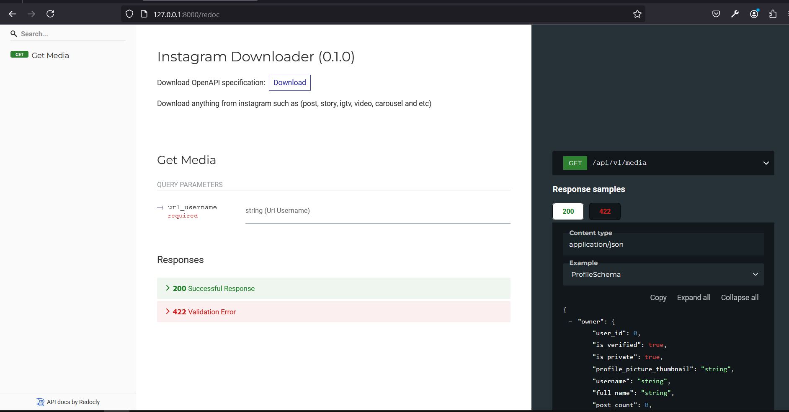

# Instagram Scraper (No Login Required)

This is a FastAPI-based Instagram scraper that extracts content from Instagram without requiring login or accounts. It utilizes HTTP residential proxies to access Instagram seamlessly and stores the scraped data in a MySQL database using SQLAlchemy.

## Features
- **No Login Required**: Scrapes Instagram content without using any account or external APIs. IGTV, Reels, Posts, Profile picture and account details
- **Residential Proxy Support**: Compatible with HTTP residential proxies to bypass restrictions.
- **MySQL Database Integration**: Stores scraped data in a structured MySQL database.
- **FastAPI Framework**: Simple, high-performance, asynchronous API for managing scraping operations.

## Tech Stack

- **Backend**: [FastAPI](https://fastapi.tiangolo.com/)
- **Database**: MySQL with [SQLAlchemy](https://www.sqlalchemy.org/) ORM
- **Scraping**: [Aiohttp](https://docs.aiohttp.org/en/stable/)
- **Proxy Support**: Tested with proxies from [Smartproxy](https://smartproxy.com/) (and similar services)

## Installation

### Prerequisites

- Python 3.8+
- MySQL server running locally or on a remote host (by default we use sqlite as db but you can change it to mysql or postgresql in settings.py)
- An active HTTP residential proxy account

### Setup

#### 1. Clone the repository:

   ```bash
   git clone https://github.com/MmdUnion/instagram-scraper.git
   cd instagram-scraper
   pip3 install -r requirements.txt
   python3 run.py
   ```
#### 2. You can change the ProxyURL, DB Config and project config in the `settings.py` file

#### 3. Access the API documentation at:<br>
   Swagger UI: http://127.0.0.1:8000/docs<br>
   ReDoc: http://127.0.0.1:8000/redoc


